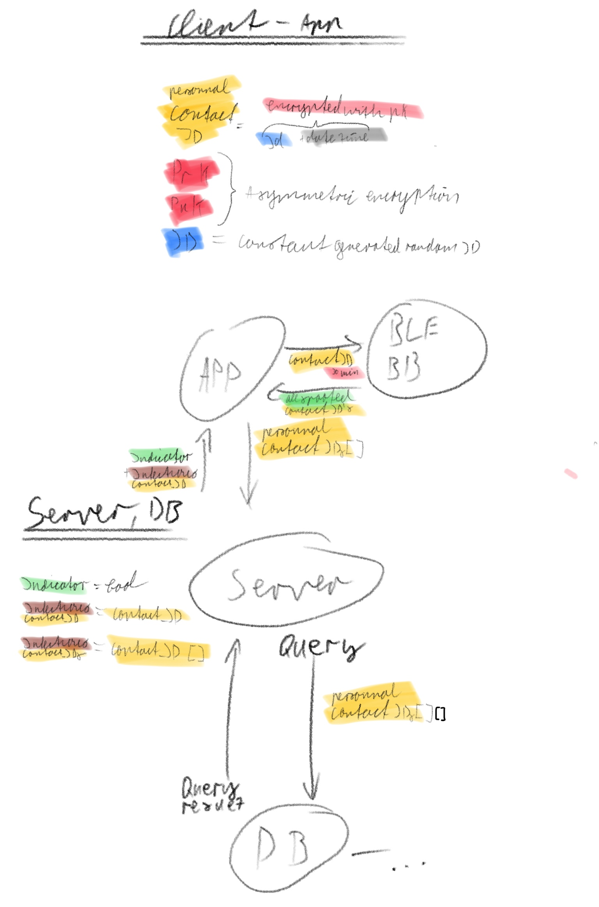
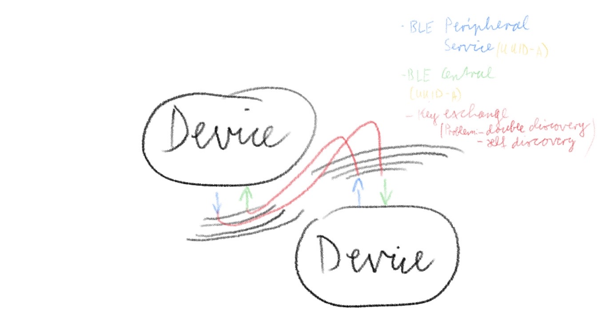

# covidIsolate

covidIsolate is an open source app, designed to indicate if a subject (user of the app), was in contact with an infectious user of the app.
The goal is to build the app as decentralized and anonymous as possible to prevent abuse, while poviding a secure and reliable platform to the enduser.
Disclaimer: This app is just a prototype and could, due to the lack of resources, not be tested in the real world!

## Concept

Social contact tracing is based on a very simple concept, since an encounter with another person is a very binary operation, which can be stored and identified easily. The general approach is that every user device emits a token(personnal contact ID), which can be stored by users which are physically close, in a way that they can later compare there collected tokens with a database and check if they have been in contact with a user who got infected. If so, this user gets a notice which requests him to stay at home for a certain amount of time(isolation time), and check for symptoms. So the challenge really is not to built the application, but to provide a performant, decentral, secure and private platform. A major part of the privacy aspect is the encryption, randomisation of the generated personnal contact ID's or tokens. There are three ways to achieve the randomisation/ encryption aspect, being: [encryption](https://de.wikipedia.org/wiki/Advanced_Encryption_Standard), [signing](https://en.wikipedia.org/wiki/RSA_(cryptosystem)#Signing_messages) and hashing(https://en.wikipedia.org/wiki/Hash_function). Hashing wouldn't be very performant and thus is not found in the consideration(*contact id encryption vs signing*).

## Technical Concept

#### Token(pCId) exchange & storage (Contact ID encryption vs signing, centralized vs decentralized)

##### Encryption

The encryption of the cId offers more privacy because the encypted cId, which is spread by the Bluetooth beacon, can not be grouped by any attribute and are completely unique. But it would also mean, that every single contact Id(for the last two weeks), of an infected user, would have to be uploaded to a central instance, so other users are able to check on their infection status. This would prohibit discrimination or tracking of users after their public key(privateKey or ID) was leaked or they got infected and their public key is published because their cIds can not be grouped/ identified by their public key or any other attribute.

###### Central infection status check

The central approach for encrypted cIds would require the central instance to not only store, but also to compare the cIds of infected users with all the collected cIds of every user who make their daily infection status check. Which increases the amount of complexity and required infrastructure of the central instance and thus the risk of failure/ outages. It would also decrease the amount of privacy since every user uploads all his cIds for the time a infected is infectious(infection time) to the central instance, which could be easilly abused by the cinstance owner.

###### Decentral infection status check

Would require all users to sync massive amounts off data, because every cId(of the last two weeks) of an infectious user would have to be downloaded to all devices, which is not even remotely possible with the current/ average bandwith per user.

##### Signing

The signing offers multiple mandatory advantages on the efficiency/ perfomance side, because, the encrypted cIds can be grouped by one public key. Which means that not every cIds of an infected user has to be published(uploaded to a central instance, so other useres can check their infection status), but only their public Key. Sadly, there is a tradeoff in privacy, because once the public key is published, users can be tracked, and potentially discriminated based up on their infection status since signing allows to group signatures by their public keys.
**This privacy flaw can only be prohibited if every users has at all times the option to change his identity (respectively all his identifiers such as private/public key and ID) and his key pair rotates every infection time cycle(to guarantee a valid infection status check for the time an infected was infectious).**

###### Central infection status check

The central approach would mean that every user uploads his signed cIds of the last two weeks to a central instance. And the comparison/ infection status check process of the signed cIds with the public keys of infected users, would be done on the central instance. That would require a huge amount of proceccing and complexity, because all public keys would have to be compare with all cIds, which makes the central approach unrealistic and overcomplicated.

###### Decentral infection status check

The decntralized approach would mean that the user downloads all the public keys of infected users and then makes the compraison/ infection status check locally on his device. This would be not only way simpler to realize, because the central instance would **only** serve as storage, which would reduce the risk of failures/ outages dramatically and would mean that the app is far more easier to scale. This approach would also mean that the **privacy of not infectious users is preserved**! Thus every user woul have to sync the (ideally two pKs)public keys of infected users to their device, in order to make the infection status check localy. Since there are a lot infected and not everybody has access to cheap and high bandwith internet, the sync of **new infected users** has to happen on an daily basis, because the number of such is dramatically lower and with that faster to snyc, than to sync all at once.

#### Conclusion/ Final concept

The goal is to find a compromise between privacy, reliability and performance with a focus on privacy while also keeping the reliability factor in mind. To achieve reliability, keeping things simple must be the first priority. This is one of the major advantages of a **decentral infection status check, which is only achievable via. a signature based contact ID**. Taking this route does not come wihtout tradeoffs, which are, as summarized above, that the key pairs must rotate to hinder tracking, etc. but still offers a great level of privacy while maintaining simplicity and scalability.
Apart from that, this concept conclusion applies to all [contact tracing requirements](https://www.ccc.de/en/updates/2020/contact-tracing-requirements), made up by the[ CCC](https://www.ccc.de/).

### Communication

To exchange the personnal contact Id's, close contact is not just a requirement on a technical level but also a condition for the conveyancing of covid19. There are not many protocols that meet the "close contact" condition that are built in modern day smartphones except for Bluetooth LE. But there are also other conditions, such as anonymity and battery drain. Luckily Bluetooth meets most of them, except for anonymity since its packages include a mac address, which is a problem on some but not all devices, since a majority of modern cellpohones includes mac address randomisation(mac address and pCId change has to happen simultaneously).

## Technical realisation

### Platform

The concept requires the application to run 24/7 and to be close to the user, since Smartphones meet all of these requirements, they are best suited as a platform. The two most important platforms are Android and IOS, Android is more open and unsafe, whereas IOS often restricts the usage of background services and ble beacons.

### Bluetooth BLE

[BLE](https://en.wikipedia.org/wiki/Bluetooth_Low_Energy) comes with two protocls GATT and GAP, both broadcast information wihtout requiring a pairing process, in contrast to the standard Bluetooth SSP. This is ideal for exchanging information on a temporary and singular basis, which is exactly what is needed since pairing would need too much power, time and the users permission to do so.
BLE offers two protocol modes, GATT, which supoorts client(peripheral)/ server(central) and GAP which supports BLE Beacons. Beacons would be great for detecting proximity but do not provide modes to transfer data, which is required since this apps concept relies (such as all others) on a token (pCId) exchange between devices.
With that kept in mind, this app uses the GATT's central/ peripheral mode to discover each other and transfer data.

Each app has a BLE peripheral and central background service running, the peripheral is constantly checking for new centrals which privide a covidIsolate service running. Once found, they wait for a certain amount of time(contact event time) before they connect to the service and the pCId exchange is happening. A double connect and exchange is prohibited by a slight one to two second variation in the required contact event time and a temp caching of last contacts to also hinder double entries to each users contact list.

### Personnal contact ID generation

The pCId represents the hashed(sha256) result of the ID(generated random RFC 4122 version 15 UUID) concatenated with a timeDate stamp. The hash is then signed(PKCS1v15)(more about this consideration can be found under "Contact ID encryption vs signing"), the resulting byte array concatenated with the raw unsigned hash represents the **personnal contact ID**.

### Infection status check

// TODO

### Personnal contacts storage

#### IOS
  All gathered pCIds and own generated public Keys are stored in apples [CoreData DB](https://developer.apple.com/documentation/coredata)
#### Android
// TODO

## Definitions

### User identifiers:

#### -Id

Randomly generated RFC 4122 version 15 UUID

#### -Public/ Privat RSA Key Pair

2048bit RSA Key Pair

### Time definitions:

#### -contact event time

The time two devices need to be close until the token(pCId) exchange happens

#### -isolation time

The time a user is suggested to stay home after his infection status check was positive

#### -infection time

The time a user was infectious for
